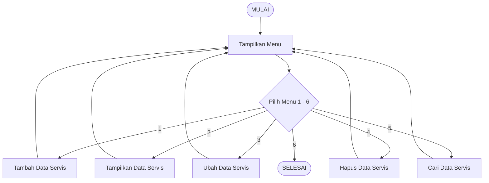

# Sistem Pengelolaan Servis Laptop

---

Program ini merupakan aplikasi berbasis **Command Line Interface (CLI)** yang dibuat menggunakan bahasa pemrograman **Java** dengan menerapkan konsep **Pemrograman Berorientasi Objek (PBO)**. Program ini dibuat untuk memenuhi tugas pada mata kuliah Pemrograman Berorientasi Objek.

---

## Identitas Mahasiswa

**Nama:** Ghea Aisyah Windraswari  
**NIM:** 2509116022
**Program Studi:** Sistem Informasi
**Instansi:** Universitas Mulawarman

---

## 1. Studi Kasus

### Sistem Pengelolaan Servis Laptop

Program yang dibuat adalah **Sistem Pengelolaan Servis Laptop**. Program ini digunakan untuk membantu mencatat data pelanggan, data laptop, dan data servis dalam satu sistem sederhana.

Program dijalankan melalui **Command Line Interface (CLI)** atau terminal. Melalui menu yang tersedia, pengguna dapat menambahkan data servis, melihat data yang sudah tersimpan, mengubah data, menghapus data, dan mencari data berdasarkan ID servis.

Dalam pembuatannya, program menggunakan konsep **Pemrograman Berorientasi Objek (PBO)**. Data dan proses program dibagi ke dalam beberapa class agar setiap class memiliki tugas yang lebih jelas.

### Fitur Program

Program ini memiliki beberapa fitur utama, yaitu:

1. **Tambah Data Servis**
   Fitur ini digunakan untuk memasukkan data pelanggan, laptop, dan informasi servis.

2. **Tampilkan Data Servis**
   Fitur ini digunakan untuk melihat data servis yang sudah dimasukkan ke dalam program.

3. **Ubah Data Servis**
   Fitur ini digunakan untuk mengubah data servis berdasarkan ID servis yang dipilih.

4. **Hapus Data Servis**
   Fitur ini digunakan untuk menghapus data servis. Sebelum data dihapus, pengguna akan diminta melakukan konfirmasi.

5. **Cari Data Servis**
   Fitur ini digunakan untuk mencari data servis berdasarkan ID servis.

6. **Keluar**
   Digunakan untuk mengakhiri penggunaan program.

Selain fitur tersebut, program juga memiliki beberapa validasi input. Validasi ini digunakan untuk mengurangi kesalahan saat pengguna memasukkan data, misalnya ketika data masih kosong atau memasukkan nilai yang tidak sesuai.

---

## 2. Struktur Class

Program ini dibagi menjadi beberapa class agar data dan fungsi di dalam program lebih terorganisir. Setiap class mempunyai peran yang berbeda sesuai dengan data yang dikelola.

### ◆ Class yang Digunakan

Class yang digunakan dalam program ini adalah:

* **Perangkat** → menyimpan data umum yang dimiliki oleh perangkat.
* **Laptop** → merupakan turunan dari class `Perangkat` dan memiliki tambahan data berupa kerusakan.
* **Pelanggan** → menyimpan informasi mengenai pelanggan.
* **Servis** → menyimpan informasi mengenai proses servis.
* **ManajemenServisLaptop** → menjadi class utama yang menjalankan menu dan proses program.

Struktur hubungan class pada program dapat dilihat pada diagram berikut:

```text
              Perangkat
             Superclass
                 ▲
                 │
              extends
                 │
               Laptop
              Subclass


              Pelanggan

                Servis

                  │
                  ▼
        ManajemenServisLaptop
             Main Program
```

Class `Laptop` memiliki hubungan inheritance dengan `Perangkat`. Sementara itu, class `Pelanggan` dan `Servis` digunakan untuk menyimpan data yang dibutuhkan dalam proses pengelolaan servis. Semua class tersebut kemudian digunakan oleh class utama untuk menjalankan program.

---

## 3. Penjelasan Masing-Masing Class

### 3.1 `Perangkat`

Class `Perangkat` digunakan sebagai class induk atau **superclass**. Saya membuat class ini untuk menyimpan data yang masih bersifat umum dan nantinya dapat digunakan oleh jenis perangkat lain.

Atribut yang terdapat pada class `Perangkat` yaitu:

* `idPerangkat`
* `merk`
* `tipe`

Contoh kode:

```java
package model;

public class Perangkat {

    private String idPerangkat;
    private String merk;
    private String tipe;

    public Perangkat(String idPerangkat, String merk, String tipe) {
        this.idPerangkat = idPerangkat;
        this.merk = merk;
        this.tipe = tipe;
    }

    public String getIdPerangkat() {
        return idPerangkat;
    }

    public void setIdPerangkat(String idPerangkat) {
        this.idPerangkat = idPerangkat;
    }

    public String getMerk() {
        return merk;
    }

    public void setMerk(String merk) {
        this.merk = merk;
    }

    public String getTipe() {
        return tipe;
    }

    public void setTipe(String tipe) {
        this.tipe = tipe;
    }
}
```

### 3.2 `Laptop`

Class `Laptop` merupakan turunan dari `Perangkat`. Karena laptop memiliki data umum seperti ID, merk, dan tipe, data tersebut tidak perlu dibuat ulang di class `Laptop`.

Untuk membuat hubungan tersebut, digunakan keyword `extends`.

```java
extends Perangkat
```

Selain mewarisi data dari `Perangkat`, class `Laptop` juga memiliki atribut tambahan yaitu `kerusakan`.

Contoh kode:

```java
package model;

public class Laptop extends Perangkat {

    private String kerusakan;

    public Laptop(String idPerangkat, String merk, String tipe, String kerusakan) {
        super(idPerangkat, merk, tipe);
        this.kerusakan = kerusakan;
    }

    public String getKerusakan() {
        return kerusakan;
    }

    public void setKerusakan(String kerusakan) {
        this.kerusakan = kerusakan;
    }
}
```

Dengan cara ini, atribut `idPerangkat`, `merk`, dan `tipe` cukup dibuat di class `Perangkat`, sedangkan `Laptop` hanya menambahkan atribut yang memang khusus dibutuhkan, yaitu `kerusakan`.

---

### 3.3 `Pelanggan`

Class `Pelanggan` digunakan untuk menyimpan data orang yang melakukan servis laptop.

Data yang disimpan terdiri dari:

* `idPelanggan`
* `nama`
* `noTelepon`
* `alamat`

Contoh:

```java
public class Pelanggan {

    private String idPelanggan;
    private String nama;
    private String noTelepon;
    private String alamat;

    public Pelanggan(String idPelanggan, String nama,
                     String noTelepon, String alamat) {
        this.idPelanggan = idPelanggan;
        this.nama = nama;
        this.noTelepon = noTelepon;
        this.alamat = alamat;
    }
}
```

---

### 3.4 `Servis`

Class `Servis` digunakan untuk menyimpan informasi yang berhubungan dengan proses servis laptop.

Atribut yang digunakan yaitu:

* `idServis`
* `tanggalMasuk`
* `status`
* `biaya`

Contoh:

```java
public class Servis {

    private String idServis;
    private String tanggalMasuk;
    private String status;
    private double biaya;

    public Servis(String idServis, String tanggalMasuk,
                  String status, double biaya) {
        this.idServis = idServis;
        this.tanggalMasuk = tanggalMasuk;
        this.status = status;
        this.biaya = biaya;
    }
}
```

---

## 4. Penerapan Inheritance

Pada program ini, inheritance digunakan pada class `Perangkat` dan `Laptop`. Saya menggunakan `Perangkat` sebagai superclass karena terdapat beberapa data yang dapat digunakan oleh class `Laptop`.

Hubungannya dapat digambarkan seperti berikut:

```text
Perangkat
    ▲
    │
  Laptop
```

Class `Laptop` dibuat dengan menggunakan keyword `extends`:

```java
public class Laptop extends Perangkat {
```

Selain itu, constructor pada `Laptop` menggunakan keyword `super`:

```java
super(idPerangkat, merk, tipe);
```

Bagian tersebut digunakan untuk memanggil constructor yang ada pada class `Perangkat`.

Dengan penerapan ini, `Laptop` dapat menggunakan data `idPerangkat`, `merk`, dan `tipe` dari `Perangkat`, kemudian menambahkan atribut `kerusakan` yang khusus digunakan untuk data laptop.

---

## 5. Pembuatan Object

Object dibuat ketika program mulai membentuk data berdasarkan class yang sudah dibuat sebelumnya.

Contohnya:

```java
Pelanggan pelanggan = new Pelanggan(
    idPelanggan,
    nama,
    noTelepon,
    alamat
);

Laptop laptop = new Laptop(
    idPerangkat,
    merk,
    tipe,
    kerusakan
);

Servis servis = new Servis(
    idServis,
    tanggalMasuk,
    status,
    biaya
);
```

Dari kode tersebut, program membuat object `Pelanggan`, `Laptop`, dan `Servis`. Object tersebut kemudian digunakan untuk menyimpan data yang dimasukkan oleh pengguna.

Pada saat object `Laptop` dibuat, constructor dari `Perangkat` juga dipanggil melalui `super()`.

---

## 6. Penggunaan ArrayList

Saya menggunakan `ArrayList` untuk menyimpan data selama program sedang berjalan. Dengan `ArrayList`, program dapat menyimpan lebih dari satu object dalam satu daftar.

Contohnya:

```java
ArrayList<Pelanggan> daftarPelanggan = new ArrayList<>();
ArrayList<Laptop> daftarLaptop = new ArrayList<>();
ArrayList<Servis> daftarServis = new ArrayList<>();
```

Setelah object dibuat, data tersebut dimasukkan ke dalam `ArrayList` menggunakan `add()`.

```java
daftarPelanggan.add(pelanggan);
daftarLaptop.add(laptop);
daftarServis.add(servis);
```

Data yang sudah tersimpan kemudian dapat digunakan kembali ketika pengguna ingin menampilkan, mengubah, menghapus, atau mencari data.

---

## 7. Menu Program

Program menggunakan menu sederhana berbasis CLI agar pengguna dapat memilih proses yang ingin dilakukan.

Contoh menu yang ditampilkan:

```text
========================================
     SISTEM PENGELOLAAN SERVIS LAPTOP
========================================
1. Tambah Data Servis
2. Tampilkan Data Servis
3. Ubah Data Servis
4. Hapus Data Servis
5. Cari Data Servis
6. Keluar
========================================
Pilih menu:
```

Pilihan dari menu diproses menggunakan `switch-case`. Setiap pilihan akan menjalankan method yang sesuai dengan fungsi menu tersebut.

Program juga menggunakan perulangan sehingga setelah satu proses selesai, pengguna dapat kembali ke menu utama tanpa harus menjalankan program dari awal.


Contohnya:

```java
switch (pilihan) {
    case 1:
        tambahDataServis();
        break;

    case 2:
        tampilkanDataServis();
        break;

    case 3:
        ubahDataServis();
        break;

    case 4:
        hapusDataServis();
        break;

    case 5:
        cariDataServis();
        break;

    case 6:
        System.out.println("Program selesai.");
        break;

    default:
        System.out.println("Pilihan menu tidak tersedia!");
}
```

---

## 8. Proses Tambah Data

Pada menu **Tambah Data Servis**, pengguna diminta memasukkan data yang berkaitan dengan pelanggan, laptop, dan servis.

Data yang dimasukkan meliputi:

* ID pelanggan
* Nama pelanggan
* Nomor telepon
* Alamat
* ID laptop/perangkat
* Merk laptop
* Tipe laptop
* Kerusakan
* ID servis
* Tanggal masuk
* Status servis
* Biaya servis

Setelah semua data diisi, program membuat object dari class `Pelanggan`, `Laptop`, dan `Servis`.

```java
Pelanggan pelanggan = new Pelanggan(...);
Laptop laptop = new Laptop(...);
Servis servis = new Servis(...);
```

Object yang sudah dibuat kemudian dimasukkan ke dalam `ArrayList` masing-masing.

---

## 9. Proses Menampilkan Data

Menu **Tampilkan Data Servis** digunakan untuk melihat data yang sebelumnya sudah dimasukkan.

Program mengambil data yang ada di dalam `ArrayList`, kemudian menampilkannya menggunakan perulangan. Informasi yang ditampilkan mencakup data pelanggan, laptop, dan servis.

Contoh hasil yang ditampilkan:

```text
================================ DATA SERVIS ================================

ID Pelanggan : P001
Nama         : James Chao
No Telepon   : 081234567801
Alamat       : Jl. P. Antasari Samarinda

ID Laptop    : L001
Merk         : ASUS
Tipe         : VivoBook 14
Kerusakan    : Keyboard beberapa tombol tidak berfungsi

ID Servis    : S001
Tanggal      : 09-09-2026
Status       : Diproses
Biaya        : Rp250000
```

---

## 10. Proses Mengubah Data

Menu **Ubah Data Servis** digunakan ketika ada informasi servis yang ingin diperbarui.

Pertama, pengguna memasukkan ID servis yang ingin diubah. Program kemudian mencari ID tersebut di dalam data yang tersimpan. Jika ID ditemukan, pengguna dapat memasukkan data baru, seperti status dan biaya servis.

Jika ID yang dimasukkan tidak ada, program akan menampilkan pesan bahwa data servis tidak ditemukan.

---

## 11. Proses Menghapus Data

Menu **Hapus Data Servis** digunakan untuk menghapus data servis berdasarkan ID yang dipilih.

Sebelum benar-benar menghapus data, program meminta konfirmasi dari pengguna. Hal ini dilakukan agar data tidak langsung terhapus apabila pengguna salah memilih ID.

Contohnya:

```text
Masukkan ID Servis: S001

Apakah Anda yakin ingin menghapus data ini? (y/n): y

Data servis berhasil dihapus.
```

Jika pengguna memberikan konfirmasi, data servis tersebut akan dihapus dari daftar.

---

## 12. Proses Pencarian Data

Program juga menyediakan fitur untuk mencari data servis berdasarkan ID servis.

Pengguna cukup memasukkan ID servis yang ingin dicari. Program kemudian memeriksa data yang ada di dalam `ArrayList`.

Jika ID ditemukan, informasi servis akan ditampilkan. Sebaliknya, jika ID tidak ditemukan, program akan memberikan pesan:

```text
Data servis tidak ditemukan.
```

---

## 13. Validasi Input

Untuk mengurangi kesalahan saat program digunakan, saya menambahkan beberapa validasi pada input.

### Validasi data kosong

Data tertentu tidak boleh dibiarkan kosong. Jika pengguna tidak mengisi data yang diperlukan, program akan memberikan pesan:

```text
Nama tidak boleh kosong!
```

### Validasi nomor telepon

Nomor telepon diperiksa agar hanya berisi angka.

```text
No. Telepon hanya boleh berisi angka!
```

### Validasi biaya

Biaya servis tidak boleh menggunakan nilai negatif.

```text
Biaya tidak boleh negatif!
```

### Validasi pilihan menu

Jika pengguna memasukkan pilihan menu yang tidak tersedia, program akan memberikan pesan:

```text
Pilihan menu tidak tersedia!
```

Validasi tersebut dibuat agar input yang masuk ke program lebih sesuai dengan data yang dibutuhkan dan mengurangi kemungkinan terjadi kesalahan saat program dijalankan.

---

## 📸 14. Screenshot Running Program

Berikut adalah screenshot yang digunakan untuk menunjukkan bahwa program dapat dijalankan melalui terminal/Command Line Interface.

### 14.1 Tampilan Menu Utama


Gambar di bawah menunjukkan tampilan awal program. Pada menu ini terdapat beberapa pilihan yang dapat digunakan untuk mengelola data servis, seperti menambah, menampilkan, mengubah, menghapus, mencari data, dan keluar dari program.

---

### 14.2 Proses Tambah Data


Gambar menunjukkan proses ketika pengguna memasukkan data pelanggan, laptop, dan servis. Setelah data dimasukkan, program menyimpan data tersebut dan menampilkannya.

---

### 14.3 Tampilan Data Servis


Gambar menunjukkan data pelanggan, laptop, dan informasi servis yang telah berhasil disimpan dan ditampilkan oleh program.

---

### 14.4 Proses Ubah Data


Gambar menunjukkan proses perubahan data servis berdasarkan ID servis. Setelah diubah, data ditampilkan kembali oleh program.

---

### 14.5 Proses Pencarian Data


Gambar menunjukkan fitur pencarian data servis untuk menampilkan data servis berdasarkan ID servis.

---

### 14.6 Proses Hapus Data


Gambar menunjukkan proses penghapusan data dengan memasukkan ID servis yang ingin dihapus. Setelah itu, program meminta konfirmasi sebelum data benar-benar dihapus.

---

## 15. Penerapan Konsep PBO

Dalam program ini, beberapa konsep dasar Pemrograman Berorientasi Objek diterapkan secara langsung pada pembuatan sistem.

### 1. Class

Program memiliki beberapa class, yaitu:

```text
Perangkat
Laptop
Pelanggan
Servis
ManajemenServisLaptop
```

Setiap class dibuat untuk menangani jenis data yang berbeda.

### 2. Object

Object dibuat menggunakan keyword `new`. Contohnya:

```java
Laptop laptop = new Laptop(
    idPerangkat,
    merk,
    tipe,
    kerusakan
);
```

Object tersebut digunakan untuk menyimpan data laptop yang dimasukkan oleh pengguna.

### 3. Encapsulation

Encapsulation diterapkan dengan membuat atribut pada class menggunakan access modifier `private`.

Contohnya:

```java
private String merk;
private String tipe;
```

Dengan cara ini, atribut tidak dapat diakses secara langsung dari luar class. Untuk mengakses atau mengubah nilainya digunakan getter dan setter.

### 4. Constructor

Constructor digunakan ketika object dibuat. Constructor membantu memberikan nilai awal pada object sesuai dengan data yang dimasukkan.

Contohnya pada class `Laptop`:

```java
public Laptop(String idPerangkat, String merk,
              String tipe, String kerusakan) {
    super(idPerangkat, merk, tipe);
    this.kerusakan = kerusakan;
}
```

### 5. Inheritance

Inheritance digunakan pada hubungan antara `Perangkat` dan `Laptop`.

```java
public class Laptop extends Perangkat
```

Dengan hubungan tersebut, `Laptop` dapat menggunakan atribut dan constructor dari `Perangkat` serta memiliki atribut tambahan berupa `kerusakan`.

### 6. ArrayList

`ArrayList` digunakan untuk menyimpan kumpulan object selama program berjalan. Data yang tersimpan di dalamnya dapat digunakan untuk proses tambah, tampil, ubah, hapus, dan pencarian data.


---

## 16. Alur Program

Alur program secara sederhana adalah:



```text
              MULAI
                │
                ▼
          Tampilkan Menu
                │
                ▼
        Pilih Menu 1 - 6
                │
       ┌────────┼────────┐
       │        │        │
       ▼        ▼        ▼
     Tambah   Tampil    Ubah
       │        │        │
       └────────┼────────┘
                │
       ┌────────┼────────┐
       │        │        │
       ▼        ▼        ▼
     Hapus    Cari     Keluar
       │        │        │
       └────────┘        ▼
             │         SELESAI
             ▼
        Kembali ke Menu
```

Program akan terus menampilkan menu sampai pengguna memilih pilihan **6. Keluar**.

---

## 17. Kesimpulan

Berdasarkan program yang telah dibuat, **Sistem Pengelolaan Servis Laptop** dapat digunakan untuk membantu proses pencatatan dan pengelolaan data pelanggan, laptop, serta servis melalui menu berbasis CLI.

Dalam pembuatan program ini, saya menerapkan beberapa konsep PBO seperti class, object, constructor, encapsulation, inheritance, dan `ArrayList`. Inheritance diterapkan pada hubungan antara `Perangkat` sebagai superclass dan `Laptop` sebagai subclass.

Selain konsep PBO, program juga memiliki fitur tambah, tampil, ubah, hapus, dan cari data serta beberapa validasi input. Dari pembuatan program ini, saya dapat memahami bagaimana konsep PBO diterapkan dalam sebuah program yang memiliki proses pengelolaan data secara langsung.
